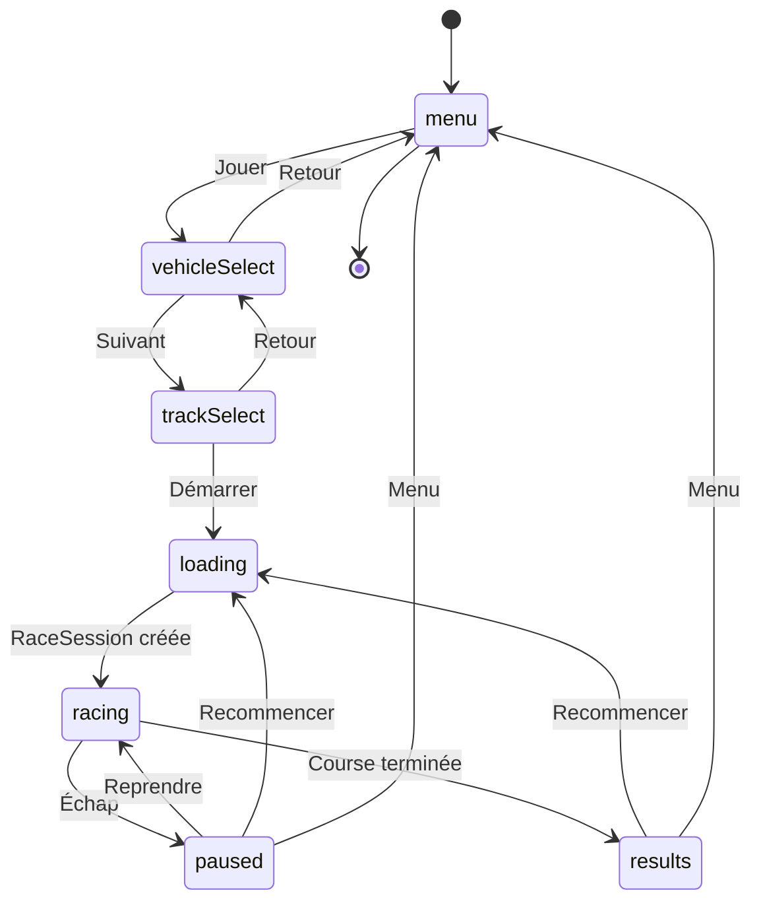
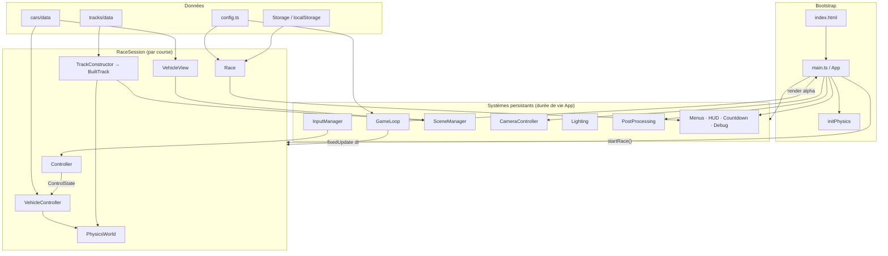
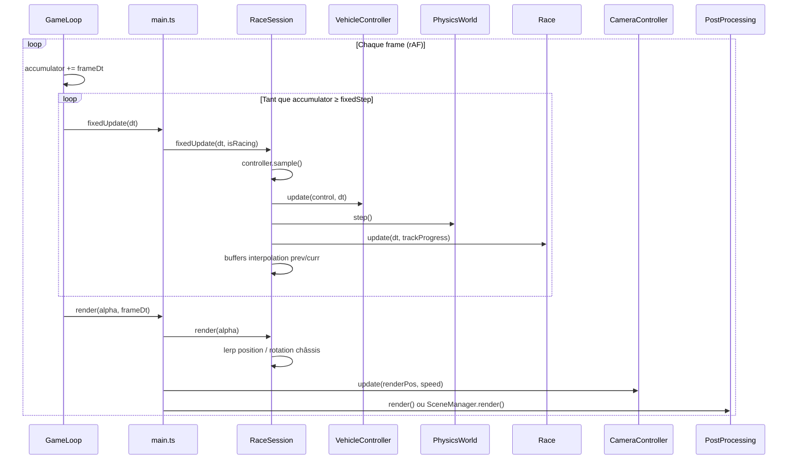
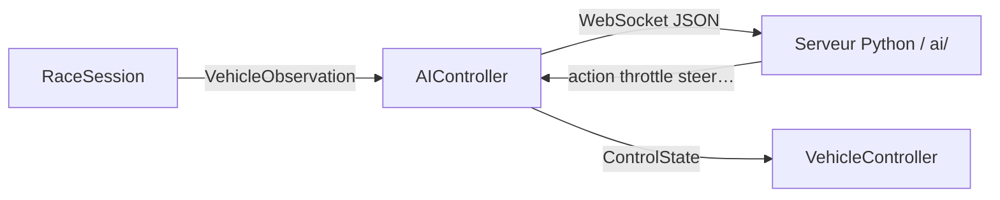

## Start game

cd game
npm install
npm run dev

Todo :

- 1er circuit d’entrainement dans stade planète terre

---

## Architecture (`game/`)

Jeu de course 3D web (style Trackmania) construit avec **Vite**, **Three.js** (rendu) et **Rapier.js** (physique). Le point d'entrée `main.ts` orchestre les systèmes persistants ; chaque course est encapsulée dans une `RaceSession` jetable.

### Stack

| Couche      | Technologie                                 |
| ----------- | ------------------------------------------- |
| Build       | Vite + TypeScript                           |
| Rendu       | Three.js (WebGL, post-processing optionnel) |
| Physique    | Rapier 3D (WASM, véhicule raycast)          |
| UI          | DOM + CSS (`ui/`)                           |
| Persistance | `localStorage` (meilleurs temps)            |
| IA (prévu)  | WebSocket → serveur Python (`ai/`)          |

### Flux applicatif

### Architecture runtime

### Boucle de jeu

La simulation physique tourne à **pas fixe** (60 Hz) ; le rendu suit la fréquence d'affichage avec **interpolation** (`alpha`) entre deux états physiques.

### Couplage des responsabilités

| Module              | Rôle                                                                                         |
| ------------------- | -------------------------------------------------------------------------------------------- |
| `main.ts`           | Machine à états UI, cycle de vie des sessions, câblage global                                |
| `RaceSession`       | Frontière simulation/rendu : construit le monde, avance la physique, expose l'état interpolé |
| `Controller`        | Découple l'entrée (humain / IA) de `VehicleController` via `ControlState`                    |
| `TrackConstructor`  | Visuel + colliders + courbe centrale + spawn + progression sur piste                         |
| `Race`              | Règles de course (tours, chrono, delta, records) indépendantes de la physique                |
| `VehicleController` | Seul module qui parle à Rapier pour le véhicule                                              |
| `VehicleView`       | Représentation Three.js synchronisée avec la physique                                        |

### Intégration IA (prévue)

Chaque frame, `RaceSession` peut pousser une observation (position, capteurs raycast, progression) vers `AIController`, qui relaie les actions reçues du serveur externe.